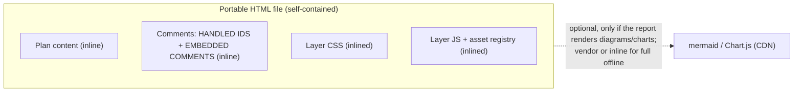
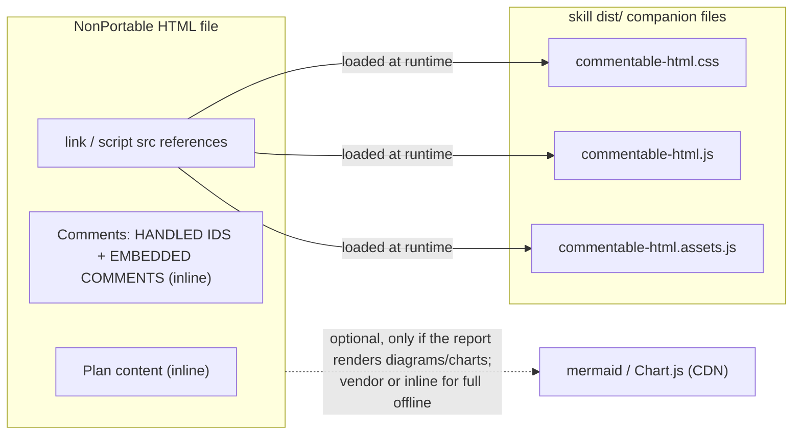
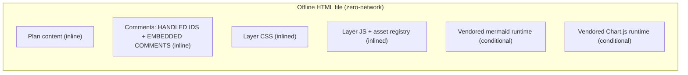

# Exports


## Contents

- [Choosing a portability mode](#choosing-a-portability-mode)
- [Producing a NonPortable document](#producing-a-nonportable-document)
- [Guardrails that make NonPortable safe](#guardrails-that-make-nonportable-safe)
- [Versioning and compatibility](#versioning-and-compatibility)
- [What is bundled in the file vs fetched from where](#what-is-bundled-in-the-file-vs-fetched-from-where)
- [Network requirements and CDN caveats](#network-requirements-and-cdn-caveats)
- [Export as Portable](#export-as-portable)
- [Export Offline](#export-offline)
- [Combined file from a nonportable document](#combined-file-from-a-nonportable-document)
- [Export to Plain HTML](#export-to-plain-html)
- [Export to Markdown](#export-to-markdown)

## Choosing a portability mode

**NonPortable** is the default authoring mode for fast personal iteration with the agent. The live HTML references shared companion assets (`commentable-html.css`, `commentable-html.js`, and `commentable-html.assets.js`), so each regeneration is much cheaper in tokens while the file can reach those assets.

**Portable** is one self-contained file with the CSS, runtime, and comments inlined. Use it for peer review, sharing, or long-term persistence. Create it with **Export as Portable**; from a nonportable source, the export inlines the companion assets and current comments into the downloaded file.

**Offline** is a Portable file plus vendored rich-content runtimes. Use **Export Offline** after mermaid diagrams and charts have rendered in the browser. It embeds the current comments, preserves live mermaid source blocks and live chart canvases, inlines vendored mermaid plus Chart.js only when needed, and removes remote loaders so the result opens with no network.


## Producing a NonPortable document

Use `tools/authoring/new_document.py` without `--portable`. It starts from `dist/NONPORTABLE.html`, keeps HANDLED IDS,
EMBEDDED COMMENTS, COMMENT UI, and content inline, and rewrites the companion references for the CSS, runtime JS, and
asset registry. By default those references are absolute `file://` URLs to the installed skill `dist/` directory, so a
loose HTML file can move anywhere on the same machine. Use `--assets-relative` for a folder whose relative path to the
skill stays valid, `--copy-assets` to copy companions next to the output, or `--assets-href PREFIX` when the caller
manages hosting.

If you must hand-produce one, start from `dist/NONPORTABLE.html`, keep the version meta stamp in sync with the
referenced companions, set a unique `data-comment-key`, and validate with `tools/validate/validate.py --strict`.


## Guardrails that make NonPortable safe

- **Version stamp and handshake.** Every generated document carries `<meta name="commentable-html-version"
  content="<V>">` and the runtime footer shows `Commentable HTML v<V>`. In NonPortable mode the runtime compares that
  page stamp with the loaded companion runtime. A same-major newer runtime can open older same-major pages without a
  warning, an older same-major runtime shows a soft update notice, and a different major is incompatible.
- **Missing-asset banner.** The NONPORTABLE BOOTSTRAP block shows a visible red banner when companion files do not
  initialize within the watchdog window.
- **Export as Portable embeds the loaded assets.** In NonPortable mode **Export as Portable** reads the CSS and JS
  strings from `window.__COMMENTABLE_ASSETS__`, inlines them with current comments, strips the companion refs, and
  downloads one Portable file. This works from `file://` because the asset registry is already loaded as a script.


## Versioning and compatibility

The page/runtime contract is backward-compatible within a major version. Any `1.x` page works with the same or a newer
`1.x` runtime. A page that needs features from a newer same-major runtime gets a soft update notice. Breaking changes
to the page/runtime contract require a major version bump.


## What is bundled in the file vs fetched from where

Portable and NonPortable keep the plan **content** and the **comments** (HANDLED IDS + EMBEDDED COMMENTS) inline in the HTML. They differ only in where the layer CSS/JS come from, and both fetch optional mermaid / Chart.js from a CDN unless you vendor or inline those libraries for full offline fidelity. Offline starts from the Portable output, then strips those remote loaders and inlines vendored mermaid / Chart.js only when the exported document actually uses them.

Portable - everything needed for the review layer travels inside the one file:



NonPortable - the layer CSS/JS are loaded at runtime from the skill's `dist/` companion files:



Offline - the review layer, comments, and rendered rich content travel in one file:




## Network requirements and CDN caveats

The review layer itself is local: NonPortable references local companion files, while Portable and Offline inline the
layer CSS, UI, state, and runtime into the HTML. Optional rich content can still depend on the network. Mermaid diagrams
and Chart.js charts load from a CDN by default unless the author vendors, self-hosts, or inlines those libraries. A
Portable file that still has CDN loaders is shareable as a review surface, but not guaranteed to render diagrams and
charts with zero network. Offline export is the zero-network path because it strips remote loaders and
inlines vetted local mermaid / Chart.js bundles only when the document needs them.


## Export as Portable

> UI label: **Export as Portable** (in the toolbar **...** overflow menu and the sidebar header). In nonportable mode it always produces a combined single file (see below).

The fifth region, **EMBEDDED COMMENTS**, is an optional in-file snapshot of the comments array so a single HTML file can travel with its own review state:

```html
<script type="application/json" id="embeddedComments">
[]
</script>
```

The overflow menu and sidebar both expose an **Export as Portable** button. It is the handoff point for the peer review loop: after your self review pass, export the Portable file, share it with a peer, then feed the peer's returned Portable HTML with embedded comments back to the agent.

All HTML exports remove the `commentable-html-session-id` and `commentable-html-agent` provenance tags by default, so a shared file does not disclose the authoring session. Select **Retain authoring session provenance** in either Export menu only when that provenance is needed for the recipient; the synchronized checkbox deliberately retains it in Portable, Offline, and Plain HTML downloads.

Clicking it:

1. Fetches the on-disk HTML (`fetch(location.href)`). If that fails (file://, network unavailable, CSP), falls back to a snapshot of `document.documentElement.outerHTML` captured on the very first line of the layer's IIFE, before any DOM mutation.
2. Replaces the contents of the `<script id="embeddedComments">` block with the current `comments` array (pretty-printed JSON, two-space indent, for git-friendly diffs).
3. Triggers a blob download via `<a download>` renamed to `<stem>-portable.html` (or `commentable-portable.html` if the URL had no `.html` segment). Existing `-comments` or `-portable` suffixes are stripped first, so `foo-comments.html` becomes `foo-portable.html` and repeated exports stay `foo-portable.html`. The browser saves it to the user's downloads folder; the user can keep the copy or replace the original.

We deliberately do NOT try to overwrite the original file in place. The File System Access API (`window.showSaveFilePicker` + a cached `FileSystemFileHandle` in IndexedDB) can attempt silent overwrites, but its semantics are confusing - the cached handle points at whatever file the user first picked, which is not necessarily the URL the page was loaded from. Always-download is unambiguous: every click produces a fresh self-contained file, and the user controls what to do with it.

On load, embedded comments are not displayed directly; they are merged into `localStorage` first. For each id that appears in both stores, the entry with the later `updatedAt` (fallback `createdAt`) wins. Ids that only appear in one store pass through unchanged. After merge the layer writes the resulting set back to localStorage so subsequent reloads converge on a single source of truth.

This means:

- A shared HTML file with embedded comments can be opened by anyone, and they immediately see the same comments without any extra step.
- A user can keep editing comments locally (composer save bumps `updatedAt`); their localStorage version wins until they click **Export as Portable** again.
- The agent's `handledCommentIds` contract is unchanged: appending an id there prunes the comment from localStorage on next load. To remove it from the embedded snapshot, click **Export as Portable** after the prune so the downloaded copy reflects the pruned state.

The `<script id="embeddedComments">` block is the **only** comment-state part of the file that **Export as Portable** rewrites (aside from inlining the layer in nonportable mode, below). By default it also removes the `commentable-html-session-id` and `commentable-html-agent` provenance meta tags; select **Retain authoring session provenance** in either Export menu before exporting to keep them. It does not regenerate any other markup, does not re-run mermaid, does not change `handledCommentIds`, and does not modify the five pasteable regions.

In **nonportable** mode, **Export as Portable** additionally inlines the CSS and runtime so the downloaded file is ONE portable, self-contained document (see below) - so the same button always yields a combined file whether the source was inline or nonportable.


## Export Offline

> UI label: **Export Offline** (overflow menu and sidebar header).

The overflow menu and sidebar expose an **Export Offline** button for handoff situations where the recipient may have no network. It is an addition to **Export as Portable**; Portable, Offline, and Plain HTML exports all remove session-id/agent provenance meta by default unless **Retain authoring session provenance** is selected, while Markdown export is unchanged.

Clicking it:

1. Builds the same Portable HTML that **Export as Portable** would build, including current embedded comments and, in NonPortable mode, the inlined review-layer CSS/JS.
2. Preserves each rendered mermaid block's source and processed state in the exported copy so the reopened file can re-render it locally from a vendored mermaid runtime. The original mermaid source stays in `data-cmh-md-src`, so Markdown export still has source text and mermaid node/comment anchors remain structural.
3. Preserves each chart canvas and its bootstrap script in the exported copy so the reopened file can recreate live Chart.js charts locally from a vendored runtime. The canvas keeps its accessible label and remains commentable as chart media.
4. Removes automatic remote loaders such as the mermaid CDN module import, Chart.js CDN `<script src>`, external stylesheet/font preloads, and remote CSS `url(...)` references, then inlines the vendored mermaid / Chart.js bundles only if the document uses those features.
5. Downloads the file with a `<stem>-offline.html` suffix.

Mermaid diagrams must already be rendered when you click the button. If a mermaid block is still source text, the export aborts with a toast rather than producing a file that would fail offline. Because the exported file keeps the live chart bootstrap instead of rasterizing canvases, zero-network reopen still preserves Chart.js tooltips and other interactivity.

The exported file still has the five Commentable HTML regions, embedded comments, and version metadata. It is intended to pass `tools/validate/validate.py --strict` and reopen with all external network blocked.


## Combined file from a nonportable document

There is no separate "Export standalone" button: **Export as Portable** does this automatically in nonportable mode. The live nonportable page only references the layer via `<link>` / `<script src>`, so the export rebuilds ONE self-contained inline file: it embeds the current comments, then inlines the CSS and runtime by reading their string payloads from the loaded `commentable-html.assets.js` registry (`window.__COMMENTABLE_ASSETS__`). Because that registry loaded as a classic `<script src>`, the payloads are already in memory - so the rebuild works even when the page was opened by double-click (`file://`), where `fetch()` of the sibling files is blocked. The downloaded file uses the same `-portable.html` suffix rule as inline export. External companion references, the version `<meta>`, and the NONPORTABLE BOOTSTRAP are stripped, and the CSS/JS region markers are restored so it passes `validate.py` in inline mode.


## Export to Plain HTML

> UI label: **Export to Plain HTML** (overflow menu and sidebar).

The overflow menu and sidebar also expose an **Export to Plain HTML** button. It downloads a standalone copy of the document with the commenting *ability* removed but its appearance intact, so the artifact can be shared or published without the review UI while looking exactly like the original. The downloaded file uses the original name with a `.plain.html` suffix (e.g. `report.html` -> `report.plain.html`). It handles both modes: in inline mode it keeps the whole inline CSS region and strips the comment regions + JS; in nonportable mode it keeps the companion `<link>` (so the content stays styled) and drops only the `<script src>` runtime companion.

What it strips and what it keeps:

- **Removes** the four HTML-comment regions (HANDLED IDS, EMBEDDED COMMENTS, COMMENT UI, JS) in full - no toolbar, sidebar, composer, menus, scripts, or stored ids.
- **Keeps every stylesheet.** The inline CSS region (or the nonportable companion `<link>`) is preserved in full, so the document's own content styling - tables, sections, code, diff, KQL, images - is identical to the original. The unused `.cm-*` UI rules are inert because their elements are gone. ("Plain" removes the commenting ability, not the styling, so the content keeps its full shipped styling.)
- **Keeps everything else untouched** - the host content, the host's own `<style>` rules, and host scripts such as the mermaid loader and theme detection. Mermaid diagrams still render in the plain copy.
- Strips the `sidebar-open` body class. It does **not** sanitize highlight marks, rings, or `data-cid` out of the content, and does not need to: the source it copies (the on-disk file or the load-time snapshot taken on the first line of the layer's IIFE) predates every runtime change, so those artifacts were never in it. Attempting document-wide regex cleanup would risk corrupting legitimate host markup (code samples, host `data-cid` attributes, script literals), so it is deliberately avoided.
- The region strip anchors each region's END on its own `<!-- ... END ... -->` comment. Because embedded comment notes escape every `<` as `\u003c`, a note can never forge a `<!--`, so note text like `END: commentable-html - EMBEDDED COMMENTS -->` cannot terminate the region early and leak the comments that follow it. As a final data-safety net, the export aborts (with a toast, no download) if a `handledCommentIds` / `embeddedComments` script somehow survives.

Implementation detail worth knowing when modifying this feature:

- **The JS region is anchored on its own `</script>`, not its END marker.** When the file is opened from `file://`, `fetch(location.href)` is blocked, so the source is taken from a DOM snapshot captured while the layer's own script is still executing. At that point the HTML parser has not yet reached the trailing `<!-- END: commentable-html - JS -->` comment, so it is absent from the snapshot. Matching the JS region by its closing `</script>` (with an optional trailing END marker) strips it correctly in both the `file://` snapshot path and the fetched on-disk path.

**Export to Plain HTML** never modifies the open document, `localStorage`, `handledCommentIds`, or the embedded comments; it only produces a downloaded copy.


## Export to Markdown

> UI label: **Export to Markdown** (overflow **...** menu and sidebar header).

Downloads the document content as a Markdown (`.md`) file. It is a deterministic, structural conversion: the layer walks the `#commentRoot` DOM (never the rendered layout) and maps each block kind to one fixed Markdown construct, so the same document always produces byte-identical output.

| Block | Markdown |
| --- | --- |
| Headings `h1`-`h6` | ATX `#`..`######` |
| Paragraphs; `strong` / `em` / `code`; links | bold `**x**`, italic `*x*`, inline `` `x` ``, and Markdown links |
| `ul` / `ol` (nested) | `- ` / `1. ` with two-space indents |
| Tables | GFM pipe tables, canonicalized to original row order even when sorted |
| Code blocks | fenced with the language from `language-*` |
| Code-review diffs | fenced `diff` (recovered from the diff source) |
| Mermaid | fenced `mermaid` (the diagram source, not the rendered SVG) |
| KQL blocks | fenced `kusto` plus the Run link |
| Charts and inline SVG figures | a `_[Chart: caption]_` / `_[Figure: caption]_` note (not representable in plain Markdown) |
| Images | Markdown image syntax with the `alt` text and `src` |
| Callouts (`cmh-callout-*`) | GitHub alerts (`> [!NOTE]` / `[!TIP]` / `[!WARNING]` / `[!CAUTION]`) |
| Interactive widgets (`data-cm-widget`) | a `_[Widget: caption]_` note plus a GFM table when the widget has `data-cm-slot` columns; otherwise a bullet list of `data-cm-part-label` values |

Your current review comments are appended as a `## Review comments` section. `cm-skip` UI chrome is never included, except a `pre.mermaid` (its source is content) and a figure caption. Because the output is a pure function of the DOM - whitespace-normalized, theme- and sort-independent, idempotent - it is covered by golden Playwright tests.
