# Commentable HTML tutorial: Planning a Community Garden

This walkthrough uses [`examples/report-community-garden.html`](../examples/report-community-garden.html) as a running example. It is a single self-contained file with prose, tables, a KQL query, a Chart.js chart, images, Mermaid diagrams, and a code-review diff, so it lets you try every kind of comment in one place.

**Were you sent a commentable HTML file to review?** You do not need an agent or an account. Select any text, click **Add Comment**, and when you are done click **Copy all** (to hand your notes to an agent) or **Export as Portable** (to send the file back with your comments baked in). The steps below show every kind of thing you can comment on.

## The review workflow

Commentable HTML turns any report into a review you can hand straight back to an AI agent. The loop has four steps:

1. **Generate.** Ask an AI chat or terminal agent to produce your report or document as a commentable HTML file.
2. **Review.** Open the file in your browser and leave inline comments anywhere: text, tables, code, KQL, charts, diagrams, diffs, or images.
3. **Hand back.** Click **Copy all** and paste the bundle back to the agent (or export the file and send it along).
4. **Refresh and repeat.** The agent edits the source and marks your comments handled; reload the updated file and the addressed comments disappear. Repeat until none remain.

The rest of this tutorial walks through step 2 in detail: every kind of thing you can comment on, and how to hand the batch back.

## 1. Open the example

1. Open [`examples/report-community-garden.html`](../examples/report-community-garden.html) in a modern browser.
2. If the comments panel is not already open, click **Comments** in the floating toolbar (upper right). Once the panel is open the toolbar is hidden; close the panel with the **Hide** button at the top of the panel.
3. Scroll through the plan once to see its sections and the in-page Contents list.

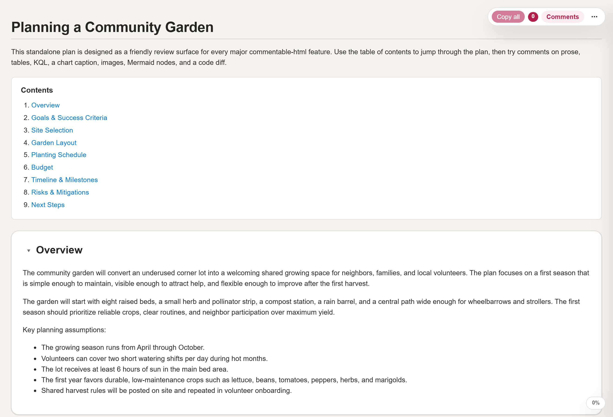

## 2. Read the document-type bubble and version

1. In the sidebar header, look at the document-type bubble.
2. It reads **Portable** (green) when the file is safe to share as-is: everything is embedded and every comment is baked in. It reads **Offline** when the file is also ready for a zero-network handoff: any Mermaid diagrams or charts keep working from inlined vendored runtimes and remote loaders are stripped. It reads **Not portable** (orange) when the file still references companion assets or has comments that are not embedded yet. Hover the bubble for the exact reason and how to make it shareable.
3. Next to the bubble, the version indicator shows `v<x.y.z>`, telling you which Commentable HTML runtime produced the file.

## 3. Open Help & About

1. Click **Help & About** in the sidebar header.
2. The first topic is the review workflow above; the rest cover every control, gesture, keyboard shortcut, the document-type bubble, exports, and the section menu. Use the search box to jump to an answer.
3. For faster work, open the **Tips and shortcuts** topic: right-click to comment, re-select the same text to reopen its comment, sort back to document order, toggle diff syntax, and the keyboard shortcuts.
4. Close it with the X button, Escape, or by clicking the backdrop.

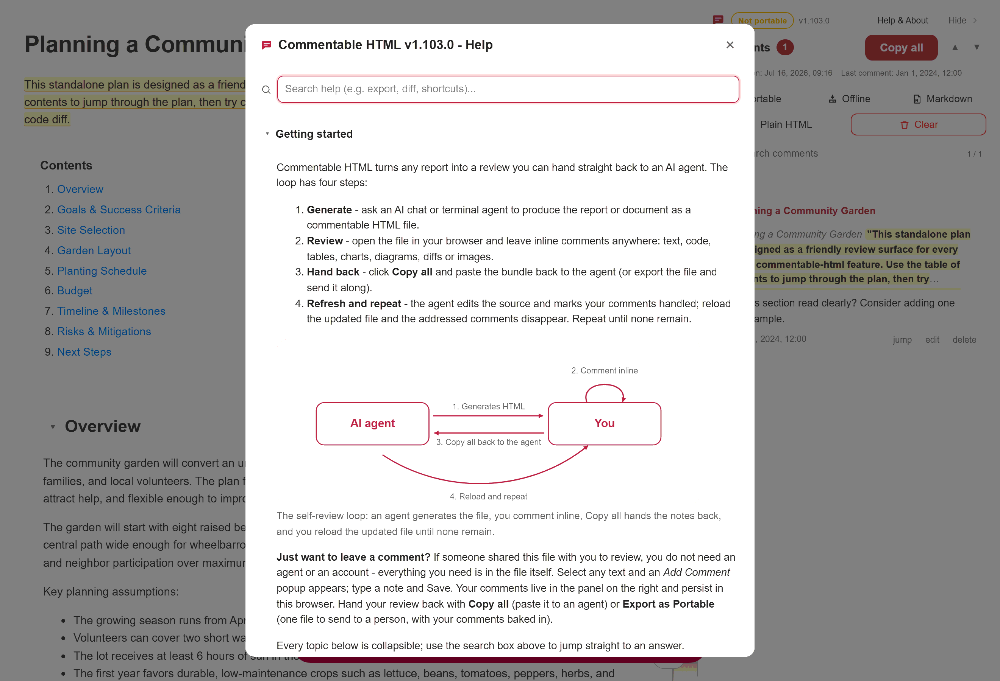

## 4. Comment on prose

1. Go to **Overview**.
2. Select the phrase `underused corner lot`.
3. Click **Add Comment** in the small popup below the selection.
4. Type a note, then click Save or press Ctrl+Enter.
5. The selected text is highlighted and a card appears in the sidebar.

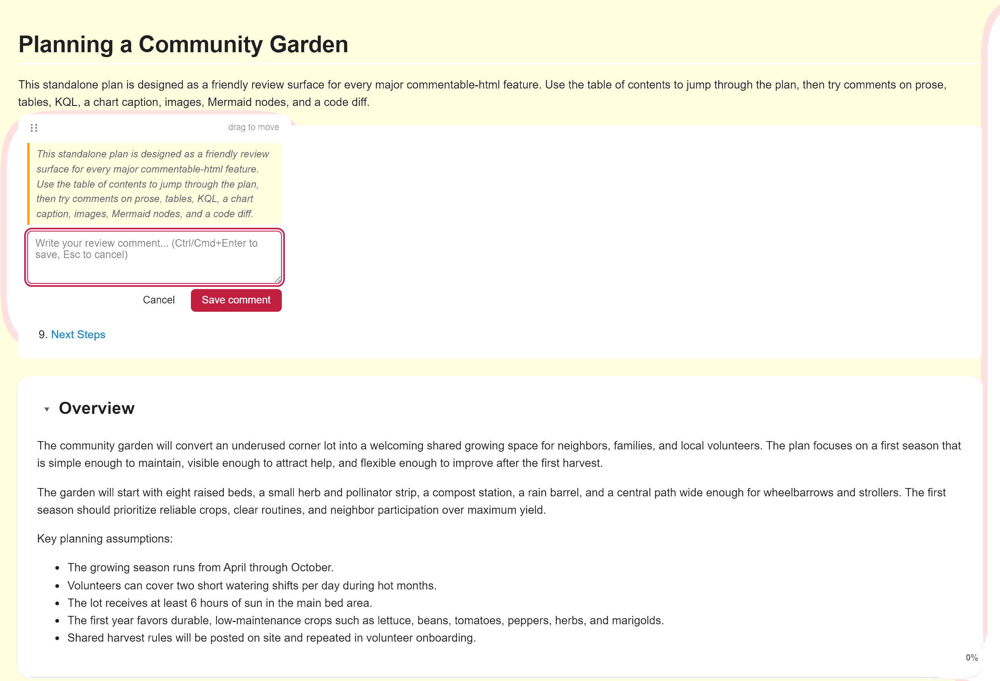

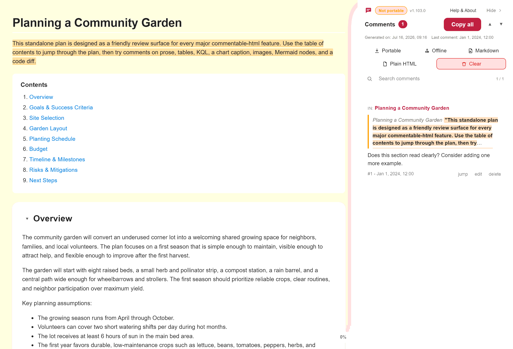

## 5. Comment on a table cell

1. Go to **Garden Layout**.
2. In the bed allocation table, select the text `Use a removable trellis`.
3. Click **Add Comment** and save a note. The card records which table cell you commented on, so the agent can find it later.

## 6. Comment on the KQL block

1. Go to **Planting Schedule**.
2. In the KQL card, select a short span inside the query.
3. Click **Add Comment** and save a note. The copied bundle preserves the selected KQL as a fenced code quote.
4. The **Run in Azure Data Explorer** link opens the same query in the Azure Data Explorer web UI, and the cluster name copies to your clipboard when you click it.

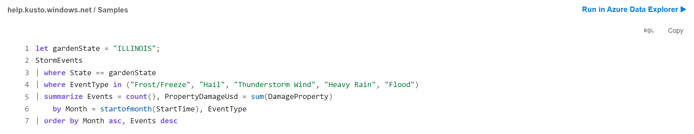

## 7. Comment on the chart

1. Stay in **Planting Schedule** and find the watering-needs chart.
2. Move the mouse over the bars to read the tooltip.
3. To comment on the chart, hover it and click **Add Comment** at its corner (the same way you comment on an image), or select text in the chart caption.
4. Save a note. A commented chart gets a highlighted outline so you can see at a glance which figures have feedback.

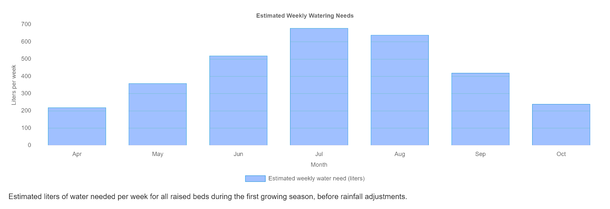

## 8. Comment on an image

1. Go to **Site Selection** or **Garden Layout**.
2. Hover an image (or focus it and press Enter).
3. Click the floating **Add Comment** button at the image corner and save a note. The comment is anchored to the whole image and quotes its alt text.

## 9. Comment on a Mermaid diagram

Mermaid diagrams render when you open the file in a modern browser. If one does not render, its source stays readable as plain text.

1. Go to **Risks and Mitigations** and find the planting decision flowchart.
2. Hover a node such as `Frost forecast in next 72 hours?`.
3. Click the floating **Add Comment** button on the node and save a note. The node gets a colored ring and the comment attaches to that node, so it survives edits to the rest of the diagram.
4. You can also comment on gantt bars, sequence-diagram messages, and subgraphs the same way, or hover an empty part of a diagram to comment on the whole thing.

## 10. Comment on a diff line

1. In **Risks and Mitigations**, find the `watering_schedule.py` diff.
2. Hover the added line `+ if rainfall_mm >= 8:` and click the floating **Add Comment** button to comment on the whole line.
3. Or select a substring within a single diff line and click **Add Comment** to comment on only that region.
4. Use the diff header button to switch between views: it reads **To inline view** while side-by-side and **To side-by-side view** while inline. Your comments stay attached either way.

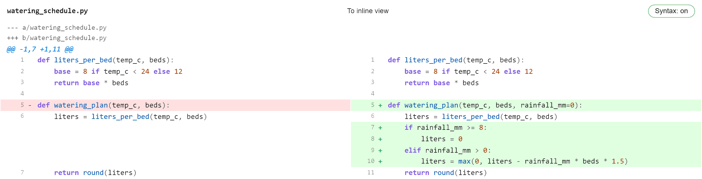

## 11. Work a review checklist

Some reports embed interactive review checklists - grouped items whose state you cycle as you verify each one. The community garden plan does not use them, so this step uses [`examples/report-checklist.html`](../examples/report-checklist.html), which is built around a release-readiness checklist.

1. Open [`examples/report-checklist.html`](../examples/report-checklist.html).
2. Click an item's box to cycle its state: blank, done (green check), failed (red cross), or unresolved (amber question). A group heading rolls up the state of its items, and clicking it propagates a state to every item beneath it.
3. Your changes are saved with the document and surface as a checklist card in the sidebar (with jump and reset), so you can hand the updated states back to the agent. You can also select an item's text and click **Add Comment** to leave a note on that specific check.

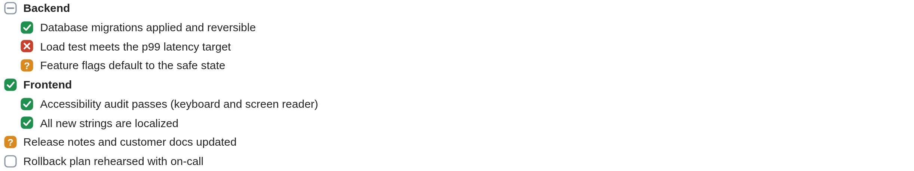

## 12. Edit a review note

Notes are editable free-text fields authors embed for context, verdicts, or reviewer input. Each starts from an authored baseline you can edit in place. The garden plan has none, so this step uses [`examples/report-notes.html`](../examples/report-notes.html).

1. Open [`examples/report-notes.html`](../examples/report-notes.html).
2. Click into a note and edit its text; use its single/multi-line toggle to switch the field height for longer entries.
3. Your changes are saved with the document and appear as a note card in the sidebar (with jump and reset), so the agent can cement them back into the source. You can also select the note text and click **Add Comment** to leave a tracked comment on it.

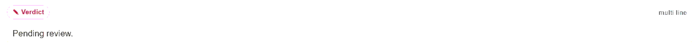

## 13. Track review progress per section

Every section heading carries a small review badge so you can mark sections as you finish them and see at a glance what is left.

1. Hover a section heading to reveal its badge, then click the badge to mark that section **Reviewed**. The badge turns green and stays visible.
2. A section you have not touched shows the default **unreviewed** state (no marker). The badge also reflects two more states automatically: a section you have commented on shows a **Commented** badge, and one whose content changed since your last visit shows a **Changed** badge.
3. Use these badges together with the section filter in the side navigation (next step) to focus on unreviewed or changed sections.

## 14. Navigate, search, and filter sections

1. Widen the browser window to at least 1400px. A generated section navigation appears on the left (separate from the author Contents list near the top) and highlights the section you are reading.
2. The nav has a search box at the top: type to filter the section list down to matching headings.
3. Below it, once you have marked a section reviewed or added a comment, a review-status filter (All / Reviewed / Unreviewed / Commented / Changed) appears and narrows the list to sections in that state, and a single-character status badge next to each entry shows its review state (R reviewed, C commented, ! changed, hollow unreviewed). Until you start reviewing, these controls stay out of the way. Use them with the per-section badges from the previous step to jump straight to what still needs attention.
4. The nav buttons let you **Expand All** or **Collapse All** sections at once and **Scroll to Top** or **Scroll to Bottom** of the document. In the document itself, each section title also has a small caret to its left: click the caret to collapse or expand that one section (clicking a collapsed section's title expands it again).

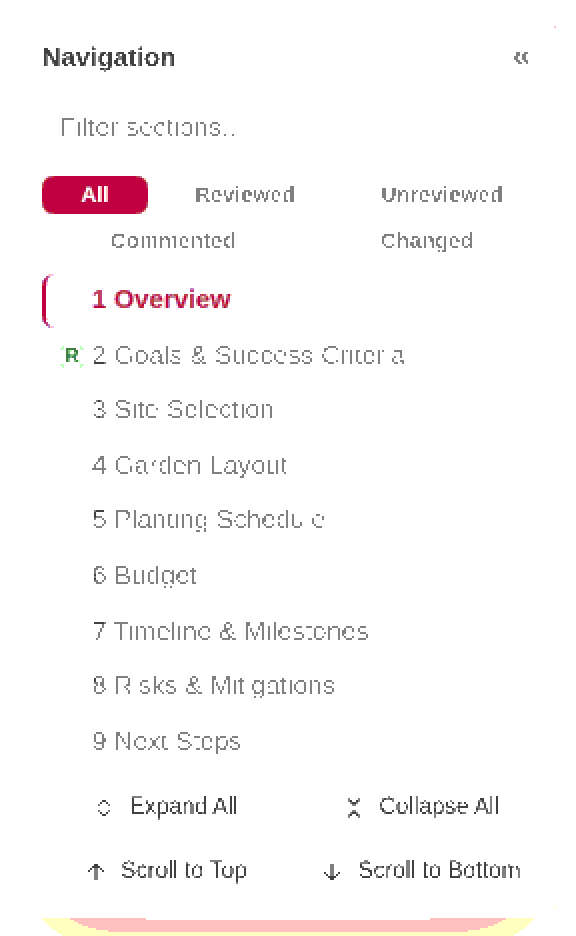

## 15. Search and sort your comments

Once you have several comments, the sidebar helps you find and order them.

1. Type in the comment search box at the top of the panel to filter the list to comments whose quoted text or note matches your query; the header shows how many of the total are shown.
2. Use the sort buttons to order comments by their position in the document, ascending or descending, instead of the order you added them.

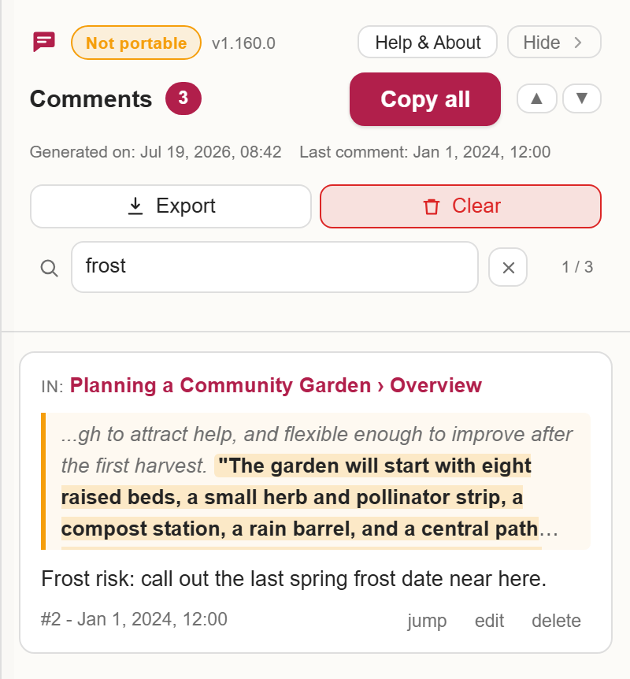

## 16. Hand your comments back

1. Click **Copy all** in the toolbar or the sidebar.
2. This copies every comment as a Markdown bundle: where each comment is, the quoted text, and your note, ending with a machine-readable handled-ids line.
3. Paste the bundle back to the agent. It addresses each comment and marks it handled in the same file.

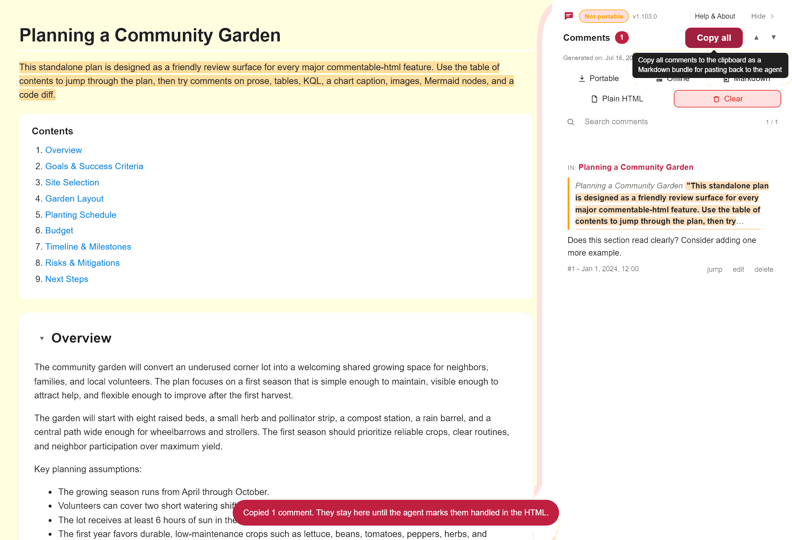

## 17. Use the export menu

The sidebar's export menu gathers the ways to save or share the file in one place.

1. Click **Export** in the comments panel header to open the menu.
2. Choose an option: **Portable** bakes your comments into a single self-contained copy, **Offline** makes a zero-network copy after diagrams and charts have rendered, **Markdown** writes the comment bundle to a `.md` file, and **Plain HTML** hands over a clean copy with the commenting layer removed.
3. The **Clear** button next to Export removes every comment so you can start the review over.

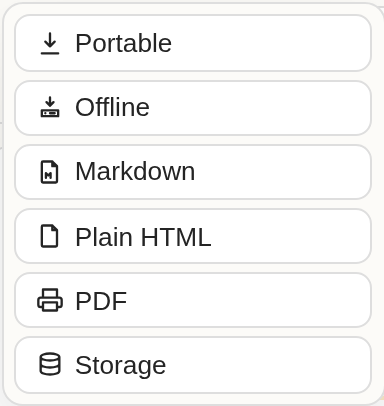

## 18. Refresh and repeat

Reload the file the agent hands back. Comments it marked handled are pruned automatically, so only open items remain. Repeat the loop until the panel is empty.

To share the review with another person instead, use the export menu's **Portable** action to bake the comments into a single self-contained copy, or **Plain HTML** to hand over a clean copy with the commenting layer removed.

Use **Export Offline** for a zero-network handoff after Mermaid diagrams and charts have rendered in the browser. It starts from the Portable export, strips remote loaders, conditionally inlines vendored Mermaid / Chart.js, and reopens with the **Offline** badge while keeping live diagrams and chart tooltips.

## 19. Review a board document

Not every commentable file is a prose report. A board document (`kind: board`) renders as columns of cards - handy for triaging incidents, tickets, or tasks. The [`examples/report-triage.html`](../examples/report-triage.html) report is one.

1. Open [`examples/report-triage.html`](../examples/report-triage.html).
2. Read the cards across the columns, then select any card text and click **Add Comment** to leave a note, just as you would in a prose report.

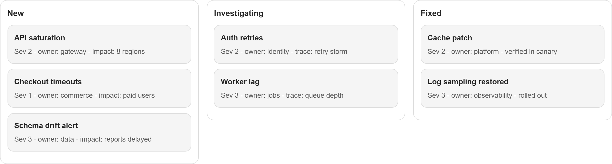

## Dark theme

The layer follows your browser or OS theme and stays readable in both. Everything above works identically in dark mode.

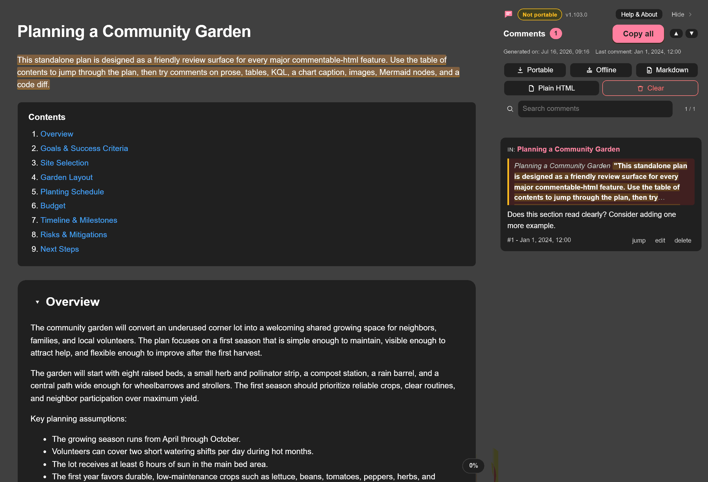