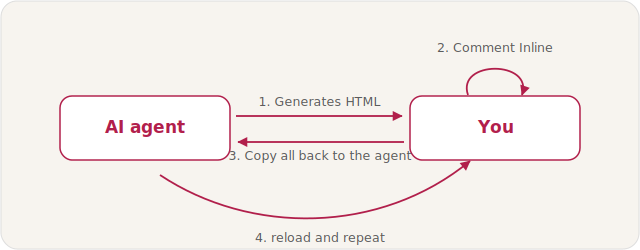

# Commentable HTML plugin

`commentable-html` turns standalone HTML reports into inline-comment review surfaces. A reviewer can select text, code, diff lines, Mermaid nodes, images, or charts, leave comments in the page, copy a compact Markdown bundle back to an agent, and export a portable file with comments embedded. It drastically shortens the AI planning and iteration loop: you review the artifact in place and hand the agent structured notes instead of narrating changes in chat.

## Privacy and compliance

Your content stays with you. Commentable HTML runs entirely in your browser as a static file - there is no server, no account, no sign-in, and no telemetry. The document you review and every comment you leave live in one of two places only:

- **In your browser's `localStorage`**, scoped to that file, while you iterate; or
- **Embedded inside the HTML file itself** once you Export as Portable (or Offline).

Your document text and your comments are never uploaded, transmitted, or sent to any external service - not to us, and not to anyone else. They travel only when you choose to share the exported file or paste the `Copy all` bundle yourself. The HTML file is the single source of truth; keep it, archive it, or delete it and the data is gone.

The only optional network activity is loading the Mermaid and Chart.js rendering libraries from a public CDN in the Non-portable and Portable modes (library code only - no document data is sent). **Export Offline** snapshots those visuals and strips every remote loader, so the file opens with zero network, suitable for air-gapped, sensitive, or regulated material.

## Why not just plan in chat, Markdown, or plain HTML?

Your agent can draft a plan in seconds; the real bottleneck is everything after - reading it, reacting to it, and getting your changes back into the model. Where that review happens decides how fast you move.

| Where you plan | Handles a big plan | Visual richness | Interactive | In-place review | Review loop |
| --- | --- | --- | --- | --- | --- |
| Chat / terminal | Poor | None | No | No | Painful |
| Markdown file | OK (needs a viewer) | Limited | No | No | Manual |
| Plain HTML | Good | Rich | Yes | No | Out-of-band |
| **Commentable HTML** | Good | Rich | Yes | **Yes** | **Tight** |

- **In the chat window** the plan scrolls past and is gone: hard to navigate, keep, or share.
- **In a Markdown file** it survives, but raw Markdown is a slog to read and stays flat - no real tables, diagrams, or charts.
- **In plain HTML** it is dense and nice to look at (Anthropic makes this case in ["The unreasonable effectiveness of HTML"](https://claude.com/blog/using-claude-code-the-unreasonable-effectiveness-of-html)), but review still breaks: you read in the browser, then switch to the chat and describe, in prose, what to change and where.
- **With Commentable HTML** you keep the rich HTML and add review in place: comment on the exact sentence, table cell, chart, or diagram node, then one `Copy all` hands the agent every note. The loop collapses to a single tight cycle. It takes the blog's "two-way interaction" idea - review the HTML, then feed your changes back to the model - and makes it first-class and in-place.

## Features

- Inline text comments anchored by offsets, including nested inline elements, entities, emoji, and RTL text.
- Code-aware comments that preserve indentation and fenced Markdown in the copy bundle.
- Line and region comments on rendered unified diffs, with inline and side-by-side views.
- Mermaid, image, and Chart.js canvas comments with structural anchors.
- Sidebar and floating toolbar for adding, editing, deleting, jumping to, and copying comments.
- `Copy all` output with pinpoint metadata and a machine-readable `HANDLED_IDS_JSON` line.
- `Export as Portable` for a single shareable file with current comments embedded.
- `Export to Plain HTML` for a clean report without the review layer.
- Standalone and NonPortable output modes, both built from the same runtime.
- Runtime helpers for validation, handled-id updates, document creation, upgrades, diffs, charts, KQL, code highlighting, TOCs, Mermaid skip fixes, and image inlining.

## Review workflow

Commentable HTML turns any report into a review you can hand straight back to an AI agent, then iterate until every comment is resolved.



- **Self review** - generate the report, comment on it, `Copy all` back to the agent, and reload; repeat until the panel is empty.
- **Peer review** - `Export as Portable` and share the single file; the peer comments in place and sends it back with the comments embedded, then you feed those back to the agent.
- **Reviewing someone's plan** - convert an incoming Markdown or HTML plan into commentable HTML, comment inline, and `Export as Portable` to send it back.

See the [tutorial](skills/commentable-html/docs/TUTORIAL.md) for a full walkthrough, or the live demo and review-loop diagram on the [project website](https://urikanonov.github.io/ai-marketplace/commentable-html/).

## Using the skill

The authoritative per-generation instructions are in [`skills/commentable-html/SKILL.md`](skills/commentable-html/SKILL.md). In short: start from `skills/commentable-html/dist/PORTABLE.html` for a standalone file, or `skills/commentable-html/dist/NONPORTABLE.html` plus its companions for a local iterative file, then run the validator when Python is available:

```powershell
python skills\commentable-html\tools\validate.py --strict <file.html>
```

The review loop is also documented in `skills/commentable-html/SKILL.md`: the user copies all comments, the agent processes the bundle, and `tools\mark_handled.py` appends handled ids so processed comments disappear on reload.

### Quickstart: build a document from a content fragment

`tools/new_document.py` wraps a ready HTML content fragment (the part that goes inside `#commentRoot`) in the review layer. Given a `report-body.html` fragment, produce a single self-contained file:

```powershell
python skills\commentable-html\tools\new_document.py `
  --content report-body.html `
  --portable `
  --label "Q3 Cost Review" `
  --key auto `
  --source report-body.html `
  --out q3-cost-review.html
python skills\commentable-html\tools\validate.py --strict q3-cost-review.html
```

`--key auto` derives a stable, collision-free `data-comment-key` from the output/source path (not from `--label`), so two same-titled reports keep separate comment stores. Drop `--portable` for a NonPortable file that references the companion assets, and pass `--content -` to read the fragment from stdin. The fragment is trusted HTML and is not sanitized; sanitize any untrusted host HTML before wrapping it.

Contributors: see the [contributing guide](https://github.com/urikanonov/ai-marketplace/blob/main/CONTRIBUTING.md). Use the issue tracker to [report a bug](https://github.com/urikanonov/ai-marketplace/issues/new?template=plugin-issue.yml), [request a feature](https://github.com/urikanonov/ai-marketplace/issues/new?template=feature-request.yml) for an existing plugin, or [suggest a new plugin or skill](https://github.com/urikanonov/ai-marketplace/issues/new?template=plugin-request.yml). Packaged installs do not include the development harness.

## Directory layout

| Path | What ships |
| --- | --- |
| `skills/commentable-html/SKILL.md` | Public skill instructions and review loop. |
| `skills/commentable-html/dist/` | Generated bundle: `PORTABLE.html`, `NONPORTABLE.html`, CSS/JS/assets companions, and `manifest.json`. |
| `skills/commentable-html/tools/` | Runtime Python tools used while generating, validating, upgrading, and processing reports. |
| `skills/commentable-html/references/` | Detailed reference docs for anchors, layout, charts, validation, exports, and helper tools. |
| `skills/commentable-html/docs/` | Tutorial and diagrams: `docs/TUTORIAL.md`, `tutorial-images/`, and `docs/images/` (the review-loop diagram embedded in this README). |
| `skills/commentable-html/examples/` | Worked prompts and reports, including `prompt-community-garden.md`, `prompt-taxi.md`, `prompt-triage.md`, `prompt-metrics.md`, `report-community-garden.html`, `report-taxi.html`, `report-triage.html`, and `report-metrics.html`. |
