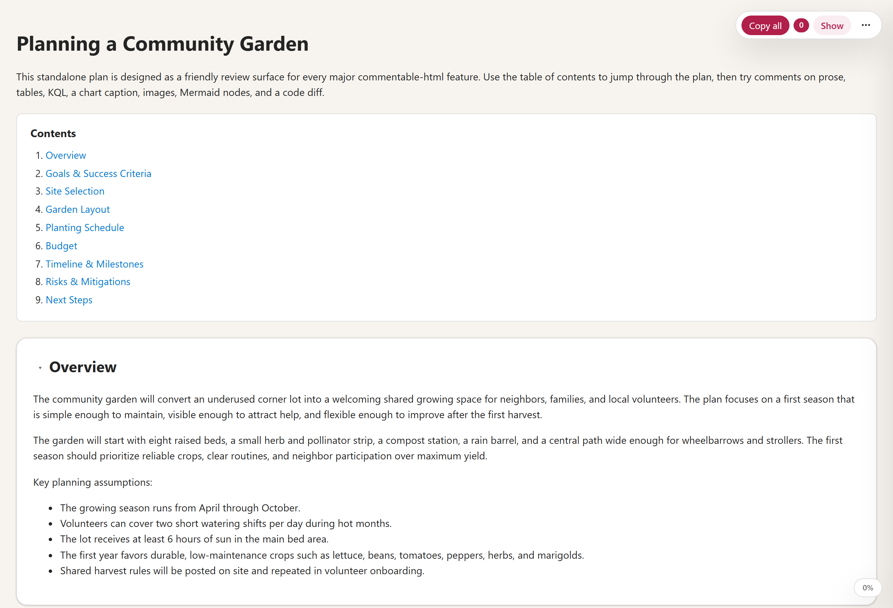
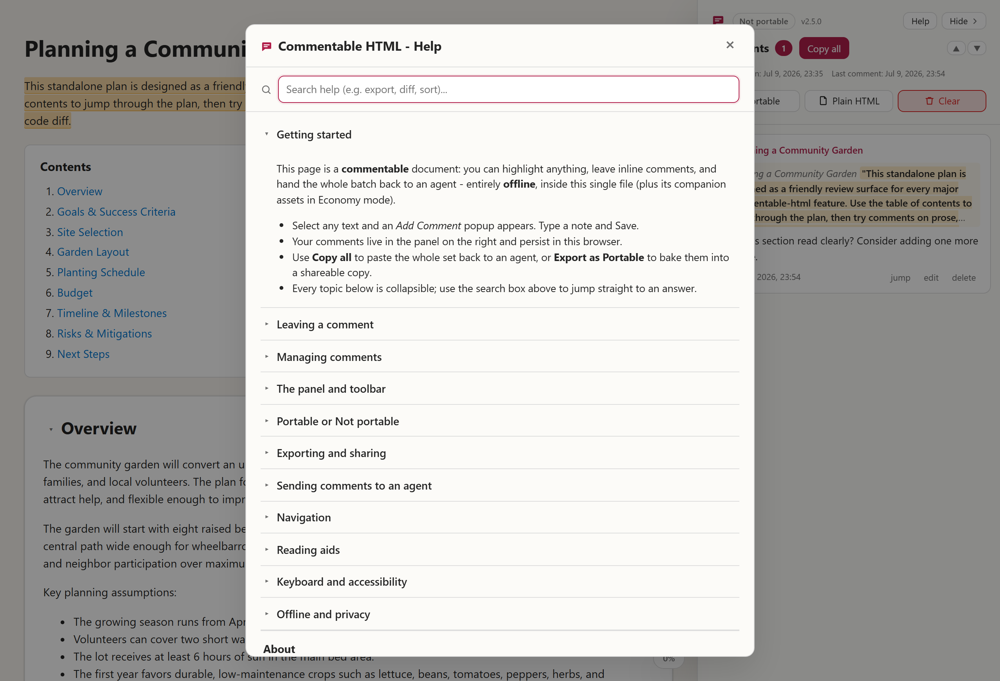
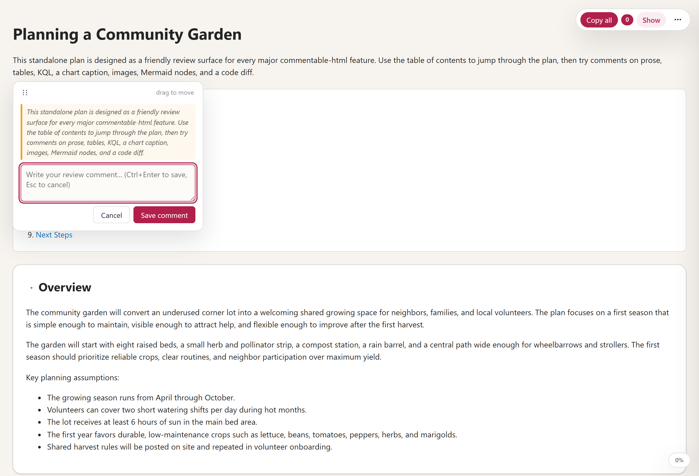
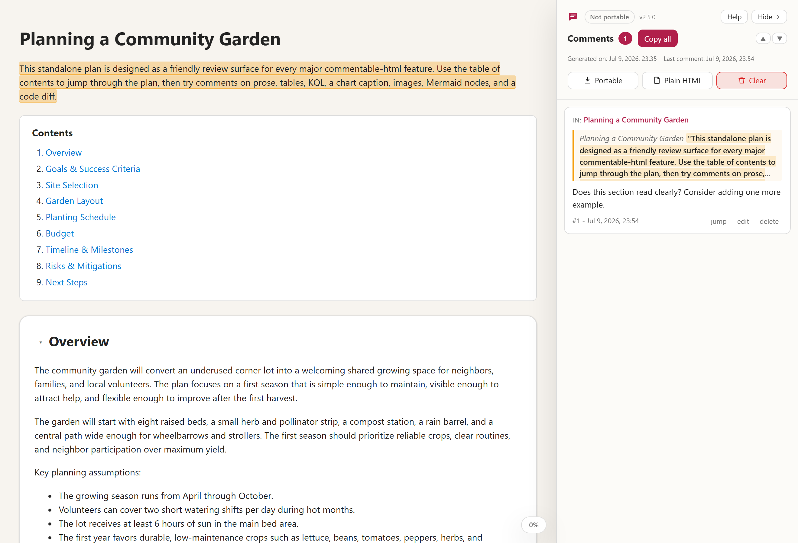
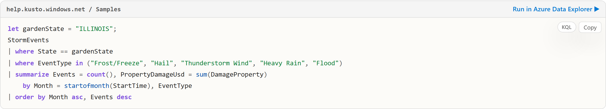
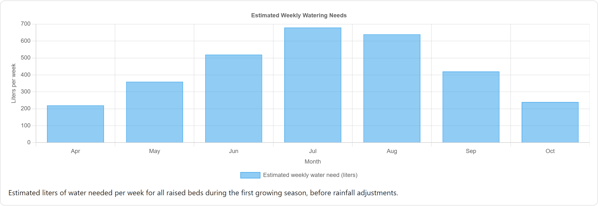
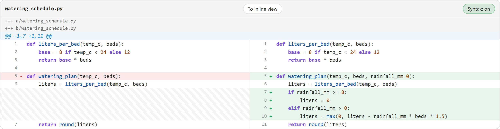
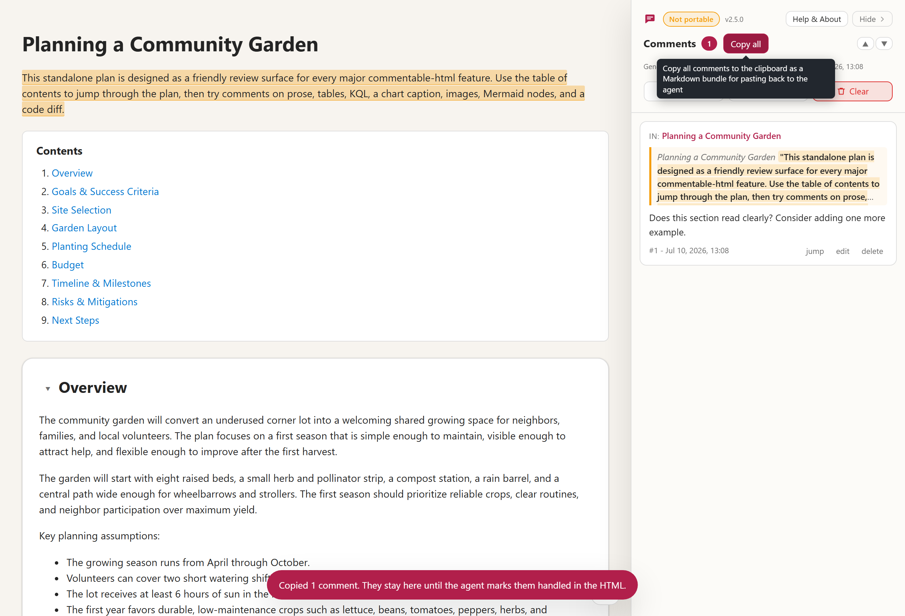
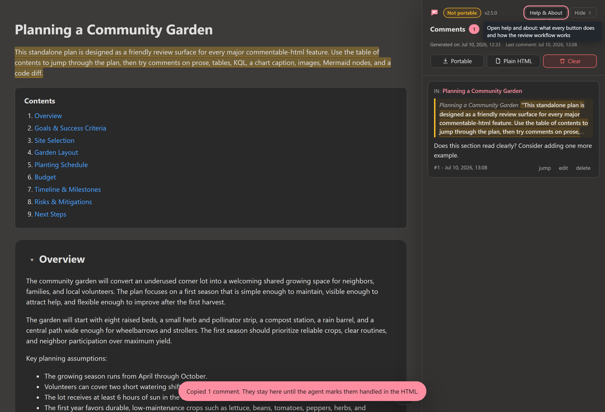

# Commentable HTML tutorial: Planning a Community Garden

This walkthrough uses [`examples/report-community-garden.html`](../examples/report-community-garden.html) as a running example. It is a single self-contained file with prose, tables, a KQL query, a Chart.js chart, images, Mermaid diagrams, and a code-review diff, so it lets you try every kind of comment in one place.

## The review workflow

Commentable HTML turns any report into a review you can hand straight back to an AI agent. The loop has four steps:

1. **Generate.** Ask an AI chat or terminal agent to produce your report or document as a commentable HTML file.
2. **Review.** Open the file in your browser and leave inline comments anywhere: text, tables, code, KQL, charts, diagrams, diffs, or images.
3. **Hand back.** Click **Copy all** and paste the bundle back to the agent (or export the file and send it along).
4. **Refresh and repeat.** The agent edits the source and marks your comments handled; reload the updated file and the addressed comments disappear. Repeat until none remain.

The rest of this tutorial walks through step 2 in detail: every kind of thing you can comment on, and how to hand the batch back.

## 1. Open the example

1. Open [`examples/report-community-garden.html`](../examples/report-community-garden.html) in a modern browser.
2. If the comments panel is not already open, click **Show** in the floating toolbar (upper right). That control reads **Hide** while the panel is open.
3. Scroll through the plan once to see its sections and the in-page Contents list.

## 2. Read the document-type bubble and version

1. In the sidebar header, look at the document-type bubble.
2. It reads **Portable** (green) when the file is safe to share as-is: everything is embedded and every comment is baked in. It reads **Not portable** (orange) when the file still references companion assets or has comments that are not embedded yet. Hover the bubble for the exact reason and how to make it shareable.
3. Next to the bubble, the version indicator shows `v<x.y.z>`, telling you which commentable-html runtime produced the file.

## 3. Open Help & About

1. Click **Help & About** in the sidebar header.
2. The first topic is the review workflow above; the rest cover every control, gesture, keyboard shortcut, the document-type bubble, exports, and the section menu. Use the search box to jump to an answer.
3. Close it with the X button, Escape, or by clicking the backdrop.

## 4. Comment on prose

1. Go to **Overview**.
2. Select the phrase `underused corner lot`.
3. Click **Add Comment** in the small popup below the selection.
4. Type a note, then click Save or press Ctrl+Enter.
5. The selected text is highlighted and a card appears in the sidebar.

## 5. Comment on a table cell

1. Go to **Garden Layout**.
2. In the bed allocation table, select the text `Use a removable trellis`.
3. Click **Add Comment** and save a note. The card records which table cell you commented on, so the agent can find it later.

## 6. Comment on the KQL block

1. Go to **Planting Schedule**.
2. In the KQL card, select a short span inside the query.
3. Click **Add Comment** and save a note. The copied bundle preserves the selected KQL as a fenced code quote.
4. The **Run in Azure Data Explorer** link opens the same query in the Azure Data Explorer web UI, and the cluster name copies to your clipboard when you click it.

## 7. Comment on the chart

1. Stay in **Planting Schedule** and find the watering-needs chart.
2. Move the mouse over the bars to read the tooltip.
3. To comment on the chart, hover it and click **Add Comment** at its corner (the same way you comment on an image), or select text in the chart caption.
4. Save a note. A commented chart gets a highlighted outline so you can see at a glance which figures have feedback.

## 8. Comment on an image

1. Go to **Site Selection** or **Garden Layout**.
2. Hover an image (or focus it and press Enter).
3. Click the floating **Add Comment** button at the image corner and save a note. The comment is anchored to the whole image and quotes its alt text.

## 9. Comment on a Mermaid diagram

Mermaid diagrams render when you open the file in a modern browser. If one does not render, its source stays readable as plain text.

1. Go to **Risks and Mitigations** and find the planting decision flowchart.
2. Hover a node such as `Frost forecast in next 72 hours?`.
3. Click the floating **Add Comment** button on the node and save a note. The node gets a colored ring and the comment attaches to that node, so it survives edits to the rest of the diagram.
4. You can also comment on gantt bars, sequence-diagram messages, and subgraphs the same way, or hover an empty part of a diagram to comment on the whole thing.

## 10. Comment on a diff line

1. In **Risks and Mitigations**, find the `watering_schedule.py` diff.
2. Hover the added line `+ if rainfall_mm >= 8:` and click the floating **Add Comment** button to comment on the whole line.
3. Or select a substring within a single diff line and click **Add Comment** to comment on only that region.
4. Use the diff header button to switch between views: it reads **To inline view** while side-by-side and **To side-by-side view** while inline. Your comments stay attached either way.

## 11. Navigate and collapse sections

1. Widen the browser window to at least 1400px. A generated section menu appears on the left (separate from the author Contents list near the top) and highlights the section you are reading; it has its own collapse toggle.
2. In the document itself, each section title has a small caret to its left: click the caret to collapse or expand that section. When a section is collapsed, clicking its title also expands it again.

## 12. Hand your comments back

1. Click **Copy all** in the toolbar or the sidebar.
2. This copies every comment as a Markdown bundle: where each comment is, the quoted text, and your note, ending with a machine-readable handled-ids line.
3. Paste the bundle back to the agent. It addresses each comment and marks it handled in the same file.

## 13. Refresh and repeat

Reload the file the agent hands back. Comments it marked handled are pruned automatically, so only open items remain. Repeat the loop until the panel is empty.

To share the review with another person instead, use **Export as Portable** to bake the comments into a single self-contained copy, or **Export to Plain HTML** to hand over a clean copy with the commenting layer removed.

## Dark theme

The layer follows your browser or OS theme and stays readable in both. Everything above works identically in dark mode.

